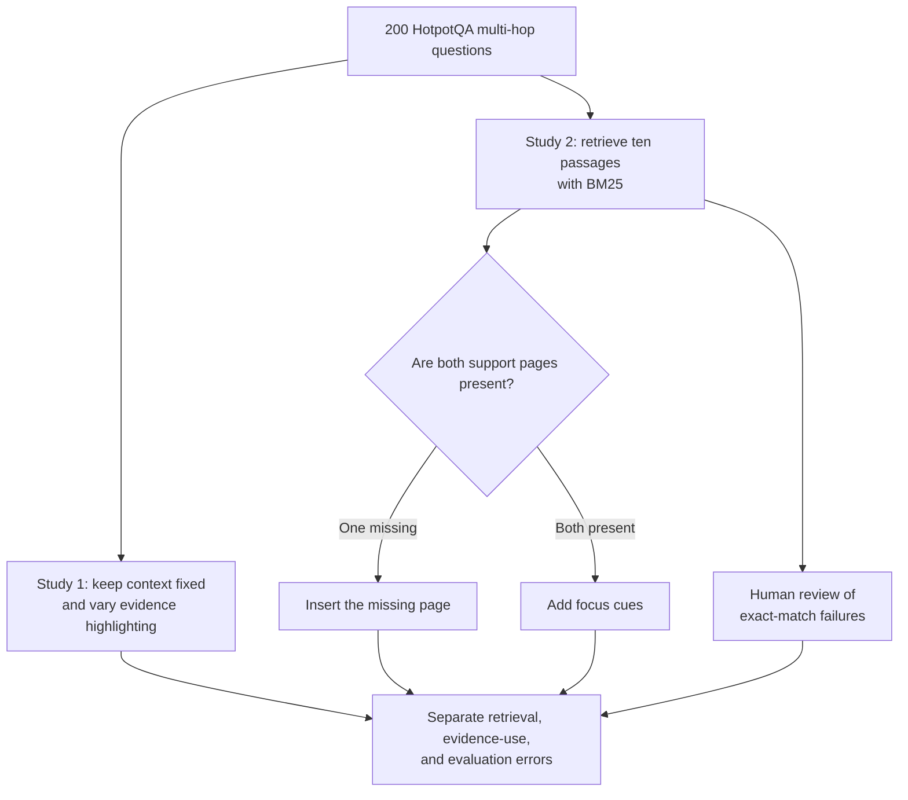

# RAG Error Diagnosis

Reproducibility package for the term paper **“Diagnosing Multi-Hop RAG Systems: Evidence Retrieval, Evidence Use, and Answer Evaluation.”**

**Authors:** Fayiz Rahman and Kritik Bansal

**Module:** Trends in Natural Language Processing, University of Trier

**Semester:** Summer Semester 2026

## What the paper is about

A retrieval-augmented generation (RAG) system can give a wrong answer for several different reasons. The retriever may fail to find a necessary document. The correct documents may be present, but the model may fail to connect their information. The model may produce a reasonable answer that an exact-string scoring rule marks as wrong. Treating all of these cases as the same kind of failure makes it difficult to improve the system.

This paper separates those possibilities in multi-hop question answering. Multi-hop questions require information from two linked documents rather than a single passage. The experiments use 200 bridge questions from HotpotQA and examine three stages of the process:

1. **Evidence emphasis:** When the context is held fixed, does visibly marking one or both supporting passages help the model answer correctly?
2. **Evidence retrieval and use:** How often does BM25 retrieve both required support pages, and what happens when the model receives them?
3. **Targeted interventions:** Does inserting a missing support page repair answers? If both pages are already present, does a simple focus cue help the model use them?

The paper also checks official exact-match failures through human review. This distinguishes genuinely incorrect answers from answers that are semantically acceptable but use a different wording from the benchmark reference.



## Main findings

- **Highlighting alone did not produce a clear average improvement.** Exact-match accuracy was 56% without highlighting, 55–56% when one support passage was highlighted, and 57% when both were highlighted. The small differences were within the experiment's uncertainty range.
- **Retrieval access mattered.** BM25 placed both annotated support pages in the top ten for 106 of 200 questions, one page for 91 questions, and neither page for three questions.
- **Supplying a missing support page often repaired the answer.** Among the 91 partial-retrieval questions, inserting the missing page increased exact-match accuracy from 30.8% to 52.7%. It repaired 23 answers and harmed three.
- **A focus cue was not enough when the evidence was already present.** Among the 106 complete-retrieval questions, marking the two support pages changed exact-match accuracy from 55.7% to 52.8%. There were two repairs and five harms, so the experiment did not establish a benefit from cueing alone.
- **Exact match overstated the number of substantive failures.** The complete-retrieval condition had 48 official exact-match failures. Human review judged 38 answers semantically correct, one partially correct, and nine incorrect. This shows why answer evaluation must be examined separately from retrieval and evidence use.

The central conclusion is that access to missing evidence can make a substantial difference, while simply drawing attention to evidence that is already present may not. The results also show that an exact-string benchmark score can hide acceptable answers. RAG evaluation should therefore report retrieval coverage, answer quality, and human assessment as separate parts of the pipeline.

These conclusions apply to the tested dataset and model configuration; they are not presented as universal claims about every RAG system.

## Experimental structure

| Component | Design | Recorded outputs |
|---|---:|---:|
| Study 1: evidence highlighting | 200 questions × 4 conditions | 800 |
| Study 2: retrieval and reader | 200 questions × 1 condition | 200 |
| Follow-up diagnostics | 197 questions × 2 paired conditions | 394 |

Study 1 changes only passage-level highlighting while keeping the question and context fixed. Study 2 retrieves ten passages from a shared development-derived corpus and asks the same reader model for a short answer. The follow-up study compares an unchanged prompt with either an inserted missing support page or a focus cue on support pages already present. All reported model responses and human-review records are included in this repository.

## Repository layout

- `experiment/` — Study 1 preparation, prompting, collection, storage, and validation.
- `analysis/` — Study 1 reconciliation, statistics, tables, and figures.
- `study2_rag/` — shared-corpus BM25 retrieval, reader collection, scoring, and analysis.
- `followup_rag/` — paired missing-page and present-page-cue diagnostics.
- `config/` — recorded study and model configurations.
- `data/` — pinned HotpotQA development data and the official evaluation script.
- `outputs/` — sealed databases, manifests, reconciliation reports, tables, figures, and human-review evidence.
- `tests/` — offline unit and synthetic integration tests.
- `scripts/verify_release.py` — checksum, SQLite, and collection-accounting verification.

## Installation

Python 3.12 is recommended.

```bash
python -m venv .venv
source .venv/bin/activate
python -m pip install -r requirements.txt
```

## Verify the archived research record

The verification command runs locally. It checks the release manifest, SQLite integrity, duplicate observations, and the reported collection totals.

```bash
python scripts/verify_release.py
```

Expected collection totals:

- Study 1: 800 committed observations from 801 operational attempts and one technical retry.
- Study 2: 200 committed observations from 200 operational attempts.
- Follow-up diagnostics: 394 committed observations.

## Analysis record

The committed tables, figures, and summaries are under `outputs/`. Their implementations are in `analysis/run.py`, `study2_rag/analysis.py`, `followup_rag/cli.py`, and `outputs/human_audit_20260930/reconcile.py`. The source-level tests exercise the scoring and statistical calculations, while `scripts/verify_release.py` confirms that the archived databases and generated artifacts have not changed.

Historical collection checksums identify the exact code and inputs used at collection time. The stored databases and scientific outputs are unchanged.

## Tests

```bash
python -m pytest -q
```

All tests use fixtures or the archived local data.

## Data and licensing

The study uses HotpotQA development data. Dataset and scorer notices are preserved in `data/reference/`. Code in this repository is released under the MIT License; third-party data and evaluation resources remain under their original terms.
